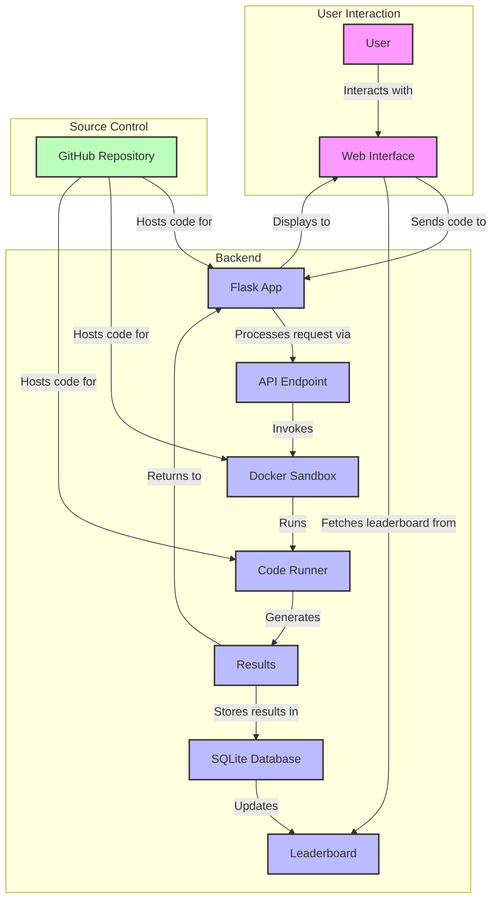

# GTA Benchmark (Guess The Algorithm)

AI reasoning benchmark through reverse-engineering of byte transformations. Test your model's algorithmic thinking capabilities!

## Overview
GTA-Benchmark challenges participants to reverse-engineer hidden transformation algorithms by examining input-output pairs. Each puzzle provides 20 visible test cases for analysis and 20 hidden test cases for validation.

## Live Demo
A running instance of GTA-Benchmark is available at http://138.197.66.242:5000/

⚠️ Note: This is a development instance for demonstration purposes.

## Prerequisites
- Python 3.9 or higher
- Docker
- pip (Python package installer)

## Structure
- Example puzzles are included in `puzzles/examples/`
- Actual benchmark puzzles are kept private
- All test buffers are 64 bytes

## Architecture

## Local Development
1. Clone the repository
2. Install requirements: `pip install -r requirements.txt`
3. Make sure Docker is running
4. Run the server: `python app.py`
5. Access the web interface at `http://localhost:5000`

## Docker Setup
The system uses Docker for secure sandbox execution of submitted solutions. Make sure:
- Docker is installed and running
- Current user has permissions to run Docker commands
- Python image `python:3.9-slim` can be pulled from Docker Hub

## Security Note
All user-submitted code runs in an isolated Docker container with:
- Memory limit: 64MB
- Execution timeout: 3 seconds
- Network access: Disabled
- Read-only filesystem
- Process limit: 100